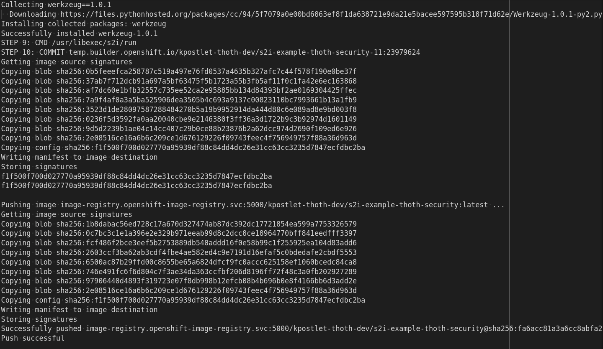
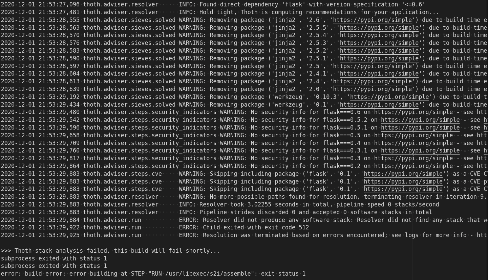

thoth-security example for OpenShift's Python s2i
----------------------------------------------

This repository contains all the materials needed to test and demo thoth
security based advises for OpenShift's s2i container image build process. For a
video walkthrough, check `this YouTube video
<https://www.youtube.com/watch?v=bOUEEh3u0Ug>`__.

The application consists of a simple Flask server that is built and deployed
into OpenShift.

Installation instructions
=========================

To install this application into your OpenShift namespace, run the following
command:

.. code-block:: console

    $ oc project <YOUR-NAMESPACE-GOES-HERE> 
    $ oc process -f https://raw.githubusercontent.com/KPostOffice/s2i-example-thoth-security/main/openshift.yaml  -p \
      THAMOS_RUNTIME_ENVIRONMENT=<latest|security> | oc apply -f -

After triggering the given command the application named
"s2i-example-thoth-security" should be built in your namespace.

The Software Stack
==================

For the software stack we only have one direct dependency, **flask**.  We lock down the version to be **<=0.6**, all
versions which are less than this have `CVE <pyupDB_>`_. With this knowledge, the expected behavior is that using Thoth
s2i with **recommendation_type==security** will result in a failure to create an image because there are no versions of
**flask** which are considered secure by Project Thoth.  On the other hand if we build using the **latest** runtime
environment then it will succesfully create an image with latest possible versions.

Latest Recommendation Results
=============================

With recommendation type set to **latest** the s2i build succeeds and a new image is pushed to the image registry.  For the
full logs of the latest build go `here <s2iLatestLogs_>`_.  This includes the resolved software stack as well as
justification generated by Thoth's advise pipeline.

Security Recommendation Results
===============================

With recommendation type set to **security** the OpenShift build will fail.  To get the build to succeed you would need
to change the requirements for your Python program to be less strict so that Thoth can find a version which satisfy the
security constraints which we impose. For full logs of the security build pipeline go `here <s2iSecurityLogs_>`_

Clean up
========

To clean up your name space after the demo, you can run the following command:

.. code-block:: console

  $ oc delete -l app=s2i-example-thoth-security bc,is,dc,route,svc

.. _pyupDB: https://github.com/pyupio/safety-db/blob/master/data/insecure_full.json
.. _s2iLatestLogs: logs/s2i-latest-logs.txt
.. _s2iSecurityLogs: logs/s2i-security-logs.txt
